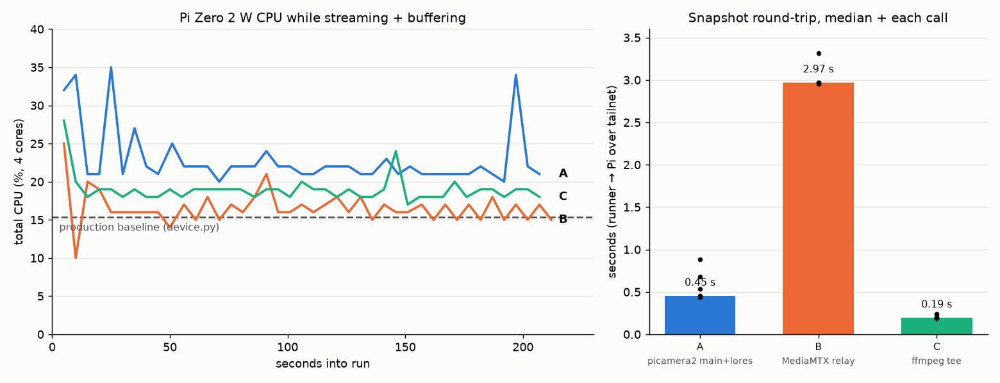
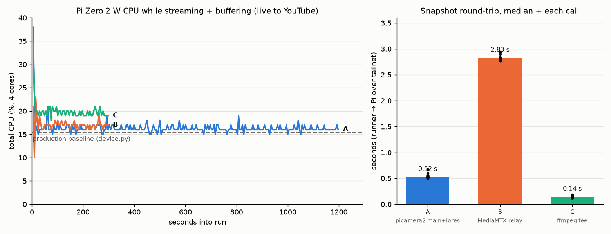
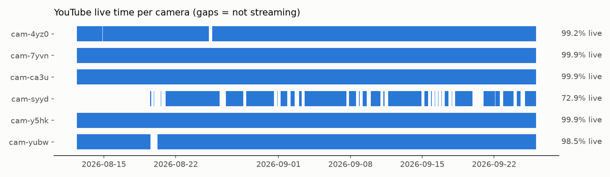

# One camera, livestream + point-and-shoot: options A–C on real hardware

Hardware trial for [issue 9](https://github.com/borysgroup/streamingLambda/issues/9). It tests the three options from
[vertical-cloud-lab/streamingLambda#6](https://github.com/vertical-cloud-lab/streamingLambda/issues/6#issuecomment-5110582954),
each on its own tailnet stream camera. All three cameras are Pi Zero 2 W boards with a Camera Module 3 (imx708) and 415 MB RAM, running Debian 13.

| Option | What runs on the Pi | Still for decisions | Clip incl. moments *before* trigger |
|---|---|---|---|
| **A** | one picamera2 process: `main` 1536x864 for stills, `lores` 640x360 → HW H.264 → production ffmpeg, plus `CircularOutput` | HTTP `/snap` → `capture_file(name="main")` | `CircularOutput`, 10 s ring in RAM |
| **B** | `rpicam-vid → ffmpeg -c copy → MediaMTX` (on the Pi). MediaMTX runs the production ffmpeg leg and records 10 s fMP4 segments | any RTSP client grabs a frame | last completed recording segment |
| **C** | production `rpicam-vid \| ffmpeg`. After drawtext, `split` feeds the encoder (tee → flv + 10 s `.ts` segments) and a 2 fps `latest.jpg` | HTTP GET `latest.jpg` | last completed tee segment |

**Test conditions.** `device.service` was paused for about 3.5 min on each camera. The "YouTube" leg used the exact `device.py` encode
(`hflip,vflip,drawtext` → `libx264 -preset ultrafast` → flv at 640x360, 15 fps) but wrote to a local file, so no broadcasts were created.
Snapshots were requested from the GitHub runner over the tailnet. The service was restarted afterwards.

| | Baseline (`device.py`) | A | B | C |
|---|---|---|---|---|
| Mean CPU (4 cores) | 15.4 % | **22.4 %** | 16.5 % | 18.7 % |
| Throttling (`get_throttled`) | 0x0 | 0x0 | 0x0 | 0x0 |
| Stream leg | 15 fps | ran continuously (see note) | 3031 frames / ~206 s ≈ 14.7 fps | 3153 frames / 209.7 s ≈ 15.0 fps |
| Snapshot round-trip, median | – | 0.45 s (on-Pi capture 0.04 s) | 2.97 s (2.1 s with `-probesize 32768 -analyzeduration 0`) | **0.19 s** |
| Still resolution | – | **1536x864** (sensor mode) | 640x360 | 640x360, timestamp burned in |
| Clip | – | 179 frames (10 s pre + 2 s post) | 150 frames (10 s) | 150 frames (10 s) |

Raw numbers: [`data/`](data). Example stills: [`snapshots/`](snapshots). Scripts: [`scripts/`](scripts).

## Takeaways

- **All three work on a Pi Zero 2 W with the stream still running.** None of them throttled. So "one process owns the camera" is not a reason to need a
  second camera; it only rules out *separate* processes like `rpicam-vid` + `rpicam-still`.
- **C is the smallest change to `device.py`.** It keeps the `rpicam-vid | ffmpeg` shape and adds one `split` and one extra output. It was also the fastest to
  serve a still. Its stills are stream resolution, and they carry the timestamp overlay, which is useful for provenance.
- **A is the one that gives real "point-and-shoot" stills.** Its stills are 1536x864 while the stream stays at 640x360, and its clip includes the 10 s before
  the trigger. It costs about 7 points more CPU, and it means replacing the `rpicam-vid` subprocess with picamera2 (`apt install python3-picamera2`).
- **B puts the most on the Pi for the least gain.** Snapshots take about 2–3 s because each RTSP client connects and waits for a keyframe. It is the right shape
  only when a separate server does the relaying and analysis, not the Pi itself.

## Gotchas found

- A: the picamera2 still is **not flipped**. `device.py` applies `hflip,vflip` in ffmpeg, so A needs `Transform(hflip=1, vflip=1)` in the camera config (now in `option_a.py`).
- A: the flv from picamera2's H.264 reported ~6100 packets over 239 s. That points to ffmpeg guessing 25 fps on the raw pipe and `-vsync cfr` padding frames.
  `-framerate 15` on the input was not enough; `-r 15` on the output fixed it (now in `option_a.py`).
- B: `runOnReady` is deprecated in MediaMTX v1.21 (use `runOnAvailable`). Also, the hook script must be executable, or MediaMTX silently never starts it.
- The tests wrote their files to `/tmp`, which is tmpfs (RAM). MemAvailable fell by about 80–110 MB over each run. For a long-running deployment, put
  segments/recordings on the SD card or cap them.

## Re-run live to YouTube

Same three cameras, but each option now pushes to the camera's real (unlisted) broadcast instead of a local flv. `device.service` was paused and its
current RTMP ingest URL reused (`enableAutoStop` is off, so the broadcast stays up). YouTube stream health was polled every 30 s through the Data API
([`data/youtube_health.csv`](data/youtube_health.csv)). A ran for 20 min and B/C for 5 min, all at the same time. A now uses the full-FOV `2304:1296` sensor mode
(like `SENSOR_MODE` in `device.py`; picamera2 otherwise picks the cropped 1536x864 mode), `Transform(hflip=1, vflip=1)`, and `-r 15`.

| | A (20 min) | B (5 min) | C (5 min) |
|---|---|---|---|
| Frames sent / duration | 17907 / 1193.8 s = **15.0 fps** (5 dup, 30 drop) | 4392 / 292.8 s = 15.0 fps | 4456 / 297.1 s = 15.0 fps |
| YouTube health polls "good" | 37/37 | 8/9 | 8/9 |
| Mean CPU (baseline 15.4 %) | **16.4 %** | 17.0 % | 19.9 % |
| Max temp / throttling | 60.1 °C / 0x0 | 53.7 °C / 0x0 | 46.2 °C / 0x0 |
| Snapshot round-trip, median | 0.52 s (on-Pi 0.04 s), 45 stills | 2.82 s | 0.14 s |
| Still | **1536x864, full FOV, upright** | 640x360 | 640x360 |

- **A is now the cheapest of the three.** The extra ~7 points of CPU in the first trial came from ffmpeg encoding ~30 fps with duplicated frames. With
  `-r 15` it is about 1 point above the production baseline. MemAvailable settles at ~150 MB about 3 minutes in and then stays flat.
- The one non-"good" poll for B and C was a single `noData` 2 min into the run. The only issue YouTube reported was `audioBitrateLow`, which production has too.
- C: 1 of 8 `latest.jpg` fetches came back truncated (8 KB) because the file was read while ffmpeg was rewriting it. `option_c.sh` now passes
  `-atomic_writing 1` (not re-run).

### Longevity (picamera2)

picamera2 was tried twice in ac-dev-lab and dropped both times:
[issue 161](https://github.com/AccelerationConsortium/ac-dev-lab/issues/161) (picamera2 streams died over a weekend while the `libcamera-vid` ones
survived), [issue 213](https://github.com/AccelerationConsortium/ac-dev-lab/issues/213), and
[PR 485](https://github.com/AccelerationConsortium/ac-dev-lab/pull/485). In the second try, ffmpeg's input `thread_queue_size` filled up when fed by
picamera2's `FfmpegOutput`. A raised limit ran for over 11 h in a fork, but that fork was never deployed. Production now uses a cron reboot every 8 h
([issue 231](https://github.com/AccelerationConsortium/ac-dev-lab/issues/231)), so any stream only has to survive 8 h.

How A here differs: it starts its own ffmpeg and writes to its stdin with `FileOutput`, so `thread_queue_size` and the ffmpeg flags are under our control.
It does not use `FfmpegOutput`. If the RTMP leg stalls, the blocked pipe write could in principle stall the encoder and the stills with it. In the long run below it did not:
stills still came back during a ~6 min upload stall. A production version should still keep `device.py`'s restart loop around the whole process.

20 minutes says nothing about 8 hours, so [`scripts/longrun_a.sh`](scripts/longrun_a.sh) was left running A to YouTube on the A camera
(`cam-syyd`) until its next cron reboot. Once a minute it logged the frame count, CPU, temperature and memory, and every 5 min it took a still. If the
frame count stopped rising, it handed the camera back to `device.service`
([`data/longrun_option_a.csv`](data/longrun_option_a.csv)).

**It stopped after 24 min, because the camera's WiFi went down, not because of picamera2.**

- 01:07–01:25 MDT: a steady 900 frames/min (15 fps), CPU 15–17 %, 59 °C, no throttling, ~160 MB free. Stills took 0.05–0.13 s.
- From 01:21 the kernel logged `brcmfmac: brcmf_sdio_*` errors from the Pi's WiFi chip, and from 01:28 about 12 per minute. The RTMP upload slowed
  and then failed with `Connection timed out`. wlan0 only came back with a new DHCP lease at 01:40.
- The same errors show up on this camera while production owns it: 75 errors at 00:23–00:24, when production's ffmpeg died with `Broken pipe` and
  `device.py` restarted it, and more at 22:48, 23:03, 02:02 and later. The other five cameras logged **zero** `brcmf_sdio` errors this boot
  ([`data/longrun_cam3_wifi_errors.csv`](data/longrun_cam3_wifi_errors.csv)). This points to a hardware or RF problem specific to `cam-syyd`.
- The still endpoint kept working while the upload was stalled: 0.04 s at 01:26 and 0.24 s at 01:31. picamera2 itself never failed.
- The handback was slow. The stall was detected at 01:31, but `sudo systemctl start device.service` only ran at 01:40, once the network was back
  (sudo probably waited on DNS). Production reconnected at 01:40 and has been up since.

So this run shows nothing about 8 h longevity either way. A fair rerun would use a camera without WiFi errors and wrap `option_a.py` in a restart
loop, the way `device.py` wraps ffmpeg.

### Why `cam-syyd`? Six weeks of YouTube history

`device.py` starts a new broadcast every time it starts, so the channel's 771 past broadcasts show when each camera was live
([`data/youtube_broadcasts.csv`](data/youtube_broadcasts.csv), [`plot_uptime.py`](plot_uptime.py)). The journals only cover the current boot.

`cam-syyd` has been live 72.9 % of the time since it came online on Aug 19. The other five were live 98.5–99.9 % of the time since Aug 12. Only
104 of its 142 broadcasts started at a cron reboot, and it regularly dropped off for most of an 8 h window, then came back at the next reboot. So its
WiFi problem is long-standing, which matches the `brcmf_sdio` errors, and it is not caused by option A.
